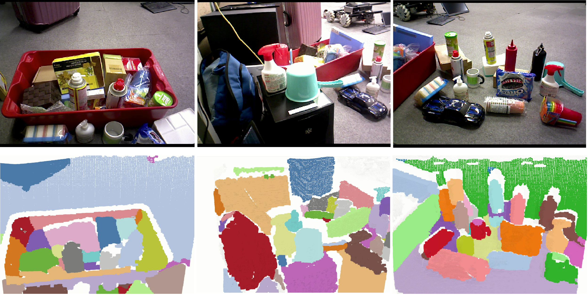

# Simple Object Segmentation
ROS Node for segmenting unknown objects using simple geometrical heuristics. 

## Requirements
- [ROS](http://wiki.ros.org/indigo) >= indigo
- [PCL](https://github.com/PointCloudLibrary/pcl) >= 1.7
- [OpenCV](https://github.com/opencv/opencv)
- [jsk_recognition](https://github.com/jsk-ros-pkg/jsk_recognition)
- [image_view2](https://github.com/jsk-ros-pkg/jsk_common)

## Compilation

```bash
git clone https://github.com/iKrishneel/simple_object_segmentation.git
cd simple_object_segmentation
catkin bt
```

## Running
to run fully automatic segmentation
```bash
roslaunch simple_object_segmentation simple_object_segmentation.launch
```
### options:
user marks a point on the image_view2 and the region the point is segmented automatically
```bash
roslaunch simple_object_segmentation simple_object_segmentation.launch user_point:=true
```


## Sample Results
